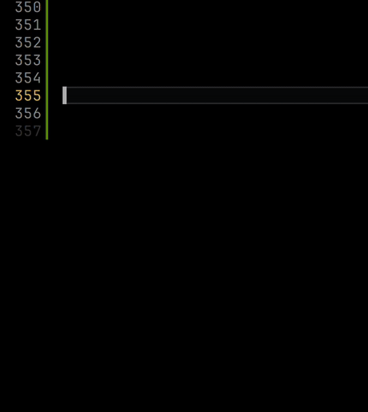

<p align="center">
    
</p>

<h1 align="center">Markdown Emoji</h1>

<p align="center">
  <a href="https://github.com/Amereyeu/Markdown-emoji">
    
  </a>
  <a href="https://open-vsx.org/extension/Amerey/markdown-emoji">
    
  </a>
  <a href="https://open-vsx.org/extension/Amerey/markdown-emoji">
    
  </a>
  <a href="https://github.com/Amereyeu/Markdown-emoji/issues">
    
  </a>
  <a href="https://ko-fi.com/amerey">
    
  </a>
</p>

## Usage

Emojis are only active in Markdown files. If they do not show up edit your `settings.json` file and add following code:

```
  "[markdown]": {
    "editor.quickSuggestions": {
      "other": true,
      "comments": false,
      "strings": false
    }
  }
```



## Symbols
 

## Objects
 

## Places
 

## Nature
 

## People
 
